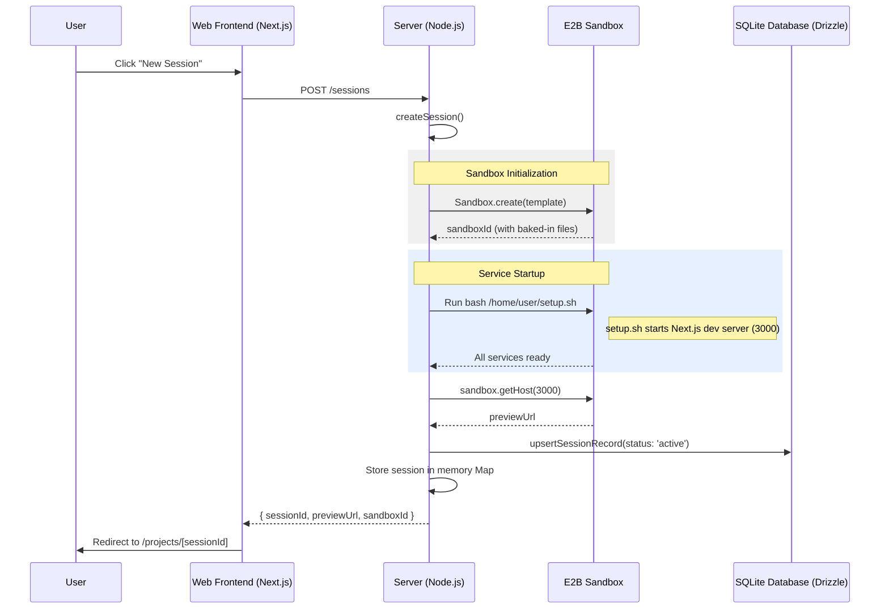

# Session Creation Flow (Simplified)

This document describes the process that occurs when a user creates a new session in the OpenCode Web IDE after the refactor to move setup into the container image.

## Sequence Diagram

## Detailed Steps

1.  **Initiation**: The user clicks the "New Session" button.
2.  **API Request**: The frontend sends a `POST` request to the `/sessions` endpoint.
3.  **Sandbox Provisioning**: The server uses the E2B SDK to create a new sandbox from a prebuilt template/image (`e2bTemplate`). This image already contains:
    *   The Next.js project template and its `node_modules`.
    *   A pre-configured `setup.sh` startup script.
4.  **Service Startup**: The server executes `bash /home/user/setup.sh` within the sandbox. This script:
    *   Launches the Next.js dev server on port 3000 in the background.
    *   Waits until the port is responsive using `netcat`.
5.  **URL Mapping**: Once services are ready, the server retrieves the public preview URL via `sandbox.getHost(3000)`.
6.  **Persistence**: The session is recorded in the SQLite database and the active instance is tracked in-memory.
7.  **Redirection**: The user is redirected to the project workspace.
